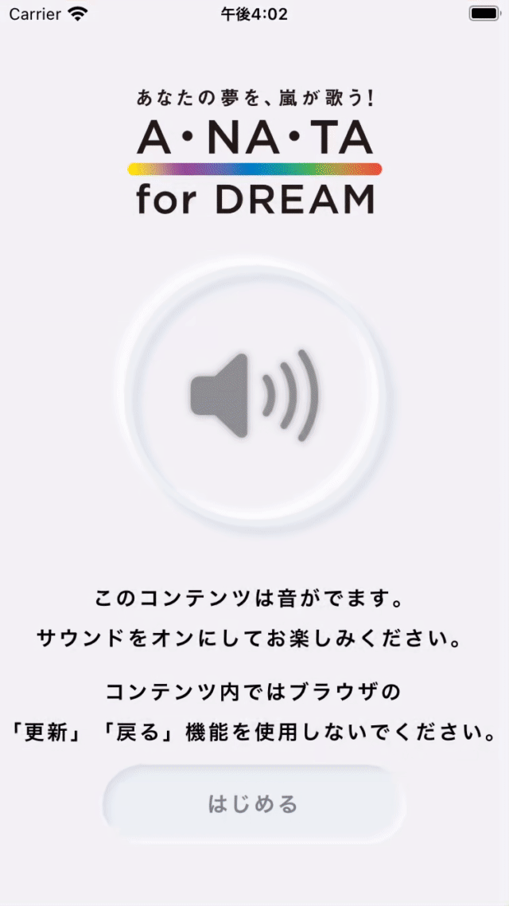

#  A・NA・TA for DREAM

This is a imitation of A・NA・TA for DREAM with SwiftUI and [Neumorphic](https://github.com/costachung/neumorphic).

  

# Requirements
- iOS 14.0+
- Xcode 12.0+

# Swift Package Dependencies
- [Neumorphic](https://github.com/costachung/neumorphic)

# ToDo
- [ ] implement view of original A・RA・SHI listening
- [ ] implement view of ARASHI's dream listening
